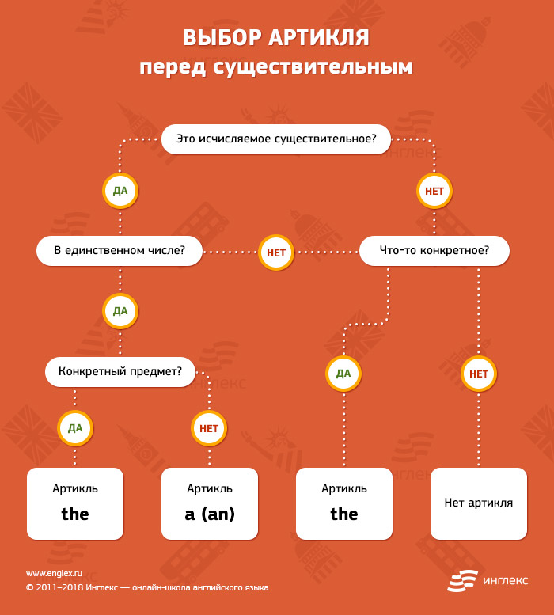

# Артикли

Артикль является одним из определителей имени существительного и ставится перед существительным или перед словами английского языка, являющимися определениями к нему.

Неопределённый артикль английского языка a (an – перед словами, начинающимися с гласной) происходит от числительного one и может употребляться только с исчисляемыми существительными в единственном числе: a house, a cat, a friend.

I am a teacher. – Я учитель.

Определённый артикль английского языка the происходит от указательного местоимения that. Часто переводится словами этот, эта, это, эти. Употребляется в английском языке перед существительными, как в единственном, так и во множественном числе в следующих случаях.

| 1.   | Когда речь идёт об определённом лице или предмете: Where is the car? – Где эта машина? (известная нам) |
| ---- | ------------------------------------------------------------ |
|      |                                                              |

| 2.   | Перед географическими названиями (названиями океанов, морей, частей света и т. д.): The Pacific ocean – Тихий океан, the Black sea – Чёрное море, the North – север, the Thames – Темза, the Alps – Альпы. |
| ---- | ------------------------------------------------------------ |
|      |                                                              |

| 3.   | Перед существительными, единственными в своём роде: The moon goes round the earth. – Луна вращается вокруг Земли. |
| ---- | ------------------------------------------------------------ |
|      |                                                              |

| 4.   | Перед существительным, если ему предшествует прилагательное в превосходной степени или порядковое числительное: What is the biggest city in the world? – Какой город самый большой в мире? |
| ---- | ------------------------------------------------------------ |
|      |                                                              |

| 5.   | В таких выражениях: in the morning – утром, in the evening – вечером, in the afternoon – после полудня. |
| ---- | ------------------------------------------------------------ |
|      |                                                              |

Отсутствие артикля (нулевой артикль)

| 1.   | Другие определители. Если перед существительным есть другие определители (местоимения – притяжательные, указательные, вопросительные, неопределённые; существительное в притяжательном падеже).  My room is large. – Моя комната широкая. |
| ---- | ------------------------------------------------------------ |
| 2.   | Множественное число.а)когда в единственном числе перед ним стоял бы неопределённый артикль: I saw a letter on the table. – Я видел письмо на столе. → I saw letters on the table. – Я видел письма на столе.б)количественное числительное обычно используется без артикля (нулевой артикль): Two men entered the room. – Двое мужчин вошли в комнату. |
| 3.   | Неисчисляемые вещественные существительные. Существительные, обозначающие названия веществ, употребляются, как правило, без артикля: water, milk, chalk, sugar, tea, snow, grass, wool, meat и т. п. При этом нужно помнить следующие особенности:а)артикль не употребляется, если речь идёт о веществе в общем смысле, даже при наличии описательного определения: He saw snow in the fields. – Я видел снег на поле.б)если речь идет о какой-то части вещества (количестве), то перед ним в утвердительных предложениях употребляется местоимение some. В вопросительных и отрицательных предложениях местоимение any. Эти местоимения обычно не переводятся на русский язык. Bring me some water. – Принеси мне воды. |
| 4.   | Неисчисляемые абстрактные существительные. Неисчисляемые абстрактные существительные (отвлечённые понятия), как правило, употребляются без артикля: weather, music, power, knowledge, art, history, mathematics, light, love, life, time и т. п. При этом нужно помнить следующие особенности:а)если они выражают абстрактные понятия в общем смысле, то артикль не употребляется: I like music. – Я люблю музыку;б)с неопределённым артиклем могут употребляться некоторые абстрактные существительные, выражающие разновидность качества, состояния, чувства и т. д: He's got a good education. – У него хорошее образование;в)если абстрактное существительное имеет индивидуализирующее определение или уточняется ситуацией, то перед ним ставится определённый артикль: Do you know the time of departure? – Ты знаешь время вылета?г)абстрактные существительные употребляются с местоимениями some, any, если речь идёт о неопределённой степени качества, состояния, проявления чувства и т. д. При этом в утвердительных предложениях употребляется some; в вопросительных и отрицательных предложениях – any. He did not show any fear. – Он не выказал страха;д)перед существительным в качестве обращения (здесь существительное, служащее обращением, рассматривается как имя собственное и употребляется без артикля): May I ask you a question, professor? – Могу я задать вам вопрос, профессор? |
| 5.   | Перед названиями стран, континентов, городов, улиц, гор, островов, озёр и т. д., а также перед именами и фамилиями. |
| 6.   | Перед названиями времён года, месяцев, дней недели.          |
| 7.   | Перед существительными dinner, breakfast, supper, tea, day, night, evening, morning, school, college, hospital. |

Внимание! The sky, the sea, the ground, the country, the environment.

Внимание! The cinema, the theatre, the radio, НО television (without the).

Внимание! Breakfast, lunch, dinner, НО We had a very nice dinner (если есть прилагательное).

