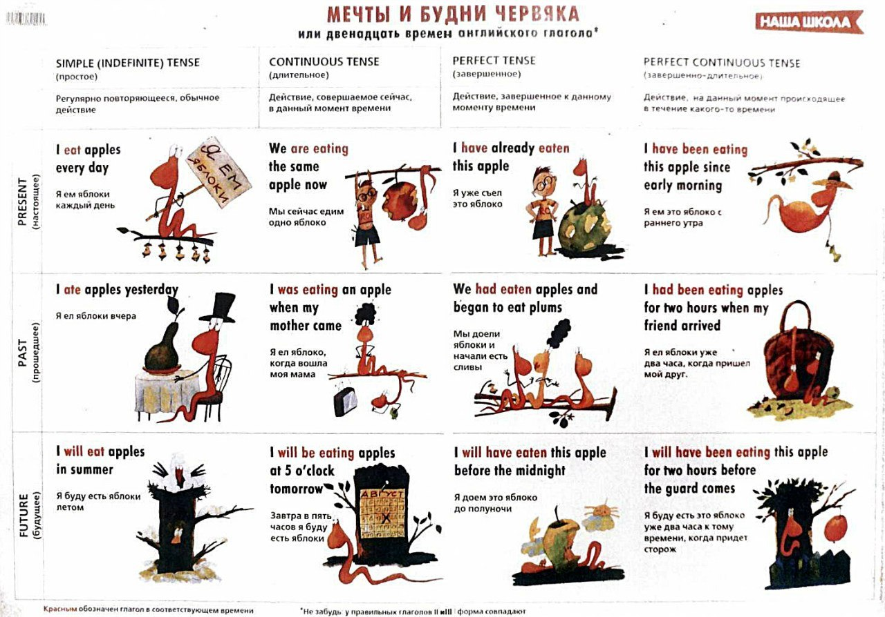
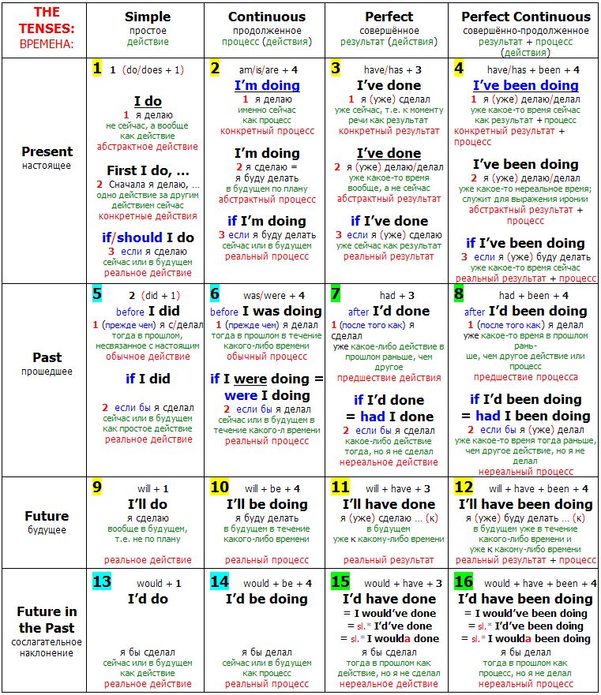
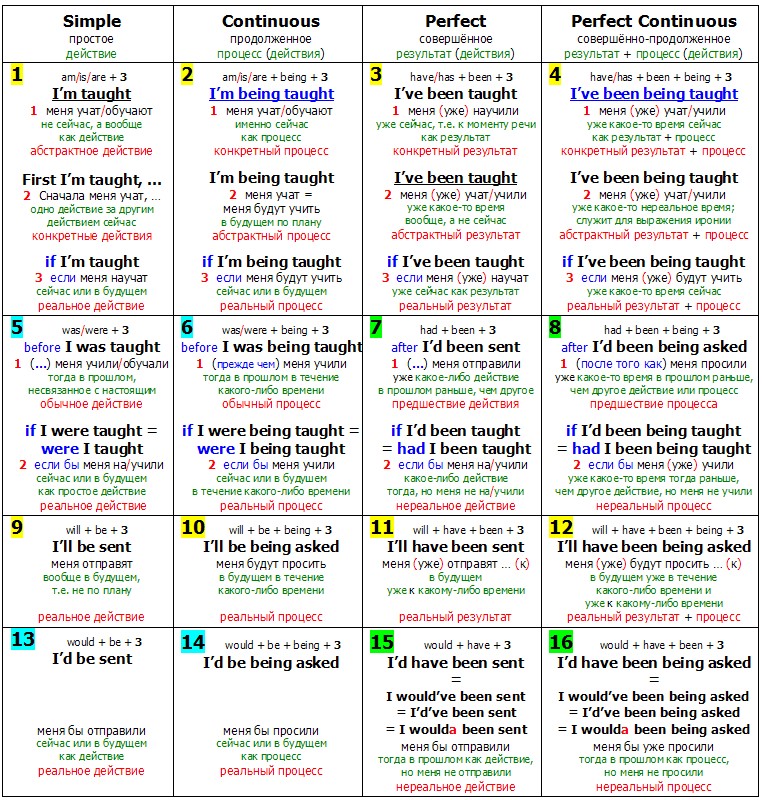

# Tenses

## Simple

* Констатация факта или общеизвестные истины
* Регулярные действи и привчки
* Расписания событий

## Continius

* Действие происходит в данный момент(сейчас)
* Действие происходящее в течении определенного периода в настоящем
* Раздражение/жалоба на чьето поведение
* Заранее точно запланированное действие
* Меняющиеся обстоятельства. Используется для описания ситуаций, которые развиваются или меняются.

## Perfect

* Законченное действие, связанное с настоящим моментом. Можем видеть результат(важен именно результат а не само действие)
* Жизненный опыт

## Perfect Continius

* Началось в прошлом, длилось какой то период, все еще продолжается.
* Началось в прошлом, длилось каокй-то период, закончилось, результат очевиден.

## Схемы:

| Past Simple                                                                                                                                               |
| --------------------------------------------------------------------------------------------------------------------------------------------------------- |
| [Непродолжительные действия в конкретный момент в прошлом](https://grammarway.com/past-simple#neprodolzhitelnye-deistviia-v-konkretnyi-moment-v-proshlom) |
| [Действия, завершенные в прошлом](https://grammarway.com/past-simple#deistviia-zavershennye-v-proshlom)                                                   |
| [Действия, которые не могут повториться](https://grammarway.com/past-simple#deistviia-kotorye-ne-mogut-povtoritsia)                                       |
| [Последовательные действия в прошлом](https://grammarway.com/past-simple#posledovatelnye-deistviia-v-proshlom)                                            |
| [Маркеры времени](https://grammarway.com/past-simple#markery-vremeni)                                                                                     |
| yesterday, the day before yesterday                                                                                                                       |
| just now, the other day                                                                                                                                   |
| last week, last decade, last century                                                                                                                      |
| an hour ago, two weeks ago                                                                                                                                |
| in 1992, at 6 o'clock                                                                                                                                     |

| Present Simple                                                                                                     |
| ------------------------------------------------------------------------------------------------------------------ |
| [Общие утверждения](https://grammarway.com/present-simple#obshchie-utverzhdeniia)                                  |
| [Общеизвестные факты](https://grammarway.com/present-simple#obshcheizvestnye-fakty)                                |
| [Регулярно повторяющиеся действия](https://grammarway.com/present-simple#reguliarno-povtoriaiushchiesia-deistviia) |
| [Расписания и договоренности](https://grammarway.com/present-simple#raspisaniia-i-dogovorennosti)                  |
| [Инструкции](https://grammarway.com/present-simple#instruktsii)                                                    |
| [Комментарии](https://grammarway.com/present-simple#kommentarii)                                                   |
| [С недлительными глаголами](https://grammarway.com/present-simple#s-nedlitelnymi-glagolami)                        |
| [В заголовках](https://grammarway.com/present-simple#v-zagolovkakh)                                                |
| [Маркеры времени](https://grammarway.com/present-simple#markery-vremeni)                                           |
| always, often, usually, regularly                                                                                  |
| sometimes, seldom, rarely, never                                                                                   |
| every day, twice a week                                                                                            |
| from time to time                                                                                                  |
| four times a month, three times a week                                                                             |
| at the weekend, at 7 o'clock                                                                                       |
| on Mondays, on Sundays                                                                                             |

| Future Simple                                                                                       |
| --------------------------------------------------------------------------------------------------- |
| [Общее будущее](https://grammarway.com/future-simple#obshchee-budushchee)                           |
| [Предположения о будущем](https://grammarway.com/future-simple#predpolozheniia-o-budushchem)        |
| [Обещания, опасения, надежды](https://grammarway.com/future-simple#obeshchaniia-opaseniia-nadezhdy) |
| [Прогнозы на будущее](https://grammarway.com/future-simple#prognozy-na-budushchee)                  |
| [Спонтанные решения](https://grammarway.com/future-simple#spontannye-resheniia)                     |
| [Маркеры времени](https://grammarway.com/future-simple#markery-vremeni)                             |
| tomorrow, tonight, later                                                                            |
| the day after tomorrow                                                                              |
| next week, next year                                                                                |
| in a week, in two days                                                                              |
| in one of these days                                                                                |
| soon, as soon as                                                                                    |

| Past Continuous                                                                                                                                                           |
| ------------------------------------------------------------------------------------------------------------------------------------------------------------------------- |
| [Продолжительные действия в конкретный момент времени в прошлом](https://grammarway.com/past-continuous#prodolzhitelnye-deistviia-v-konkretnyi-moment-vremeni-v-proshlom) |
| [Одновременные действия в прошлом](https://grammarway.com/past-continuous#odnovremennye-deistviia-v-proshlom)                                                             |
| [Выражение неодобрения](https://grammarway.com/past-continuous#vyrazhenie-neodobreniia)                                                                                   |
| [Запланированные действия, которые не произошли](https://grammarway.com/past-continuous#zaplanirovannye-deistviia-kotorye-ne-proizoshli)                                  |
| [Маркеры времени](https://grammarway.com/past-continuous#markery-vremeni)                                                                                                 |
| while, when, as                                                                                                                                                           |
| all morning, all day, all night                                                                                                                                           |
| last Monday, last week                                                                                                                                                    |
| at that moment                                                                                                                                                            |
| at the same time                                                                                                                                                          |

| Present Continuous                                                                                                            |
| ----------------------------------------------------------------------------------------------------------------------------- |
| [Действия, происходящие здесь и сейчас](https://grammarway.com/present-continuous#deistviia-proiskhodiashchie-zdes-i-seichas) |
| [Действия around now](https://grammarway.com/present-continuous#deistviia-around-now)                                         |
| [Планы на ближайшее будущее](https://grammarway.com/present-continuous#plany-na-blizhaishee-budushchee)                       |
| [Меняющиеся обстоятельства](https://grammarway.com/present-continuous#meniaiushchiesia-obstoiatelstva)                        |
| [Негативный окрас действий](https://grammarway.com/present-continuous#negativnyi-okras-deistvii)                              |
| [Маркеры времени](https://grammarway.com/present-continuous#markery-vremeni)                                                  |
| now, right now                                                                                                                |
| still, currently                                                                                                              |
| at the moment, at present                                                                                                     |
| this morning, this afternoon                                                                                                  |
| today, tonight, these days                                                                                                    |
| nowadays                                                                                                                      |

| Future Continuous                                                                                                                                                             |
| ----------------------------------------------------------------------------------------------------------------------------------------------------------------------------- |
| [Продолжительные действия в конкретный момент времени в будущем](https://grammarway.com/future-continuous#prodolzhitelnye-deistviia-v-konkretnyi-moment-vremeni-v-budushchem) |
| [Одновременные действия в будущем](https://grammarway.com/future-continuous#odnovremennye-deistviia-v-budushchem)                                                             |
| [События, которые непременно произойдут](https://grammarway.com/future-continuous#sobytiia-kotorye-nepremenno-proizoidut)                                                     |
| [Запланированные действия](https://grammarway.com/future-continuous#zaplanirovannye-deistviia)                                                                                |
| [Вежливый вопрос о планах на будущее](https://grammarway.com/future-continuous#vezhlivyi-vopros-o-planakh-na-budushchee)                                                      |
| [Маркеры времени](https://grammarway.com/future-continuous#markery-vremeni)                                                                                                   |
| this time tomorrow                                                                                                                                                            |
| the same time next week                                                                                                                                                       |
| at 5 o'clock, at that moment                                                                                                                                                  |
| meanwhile, meantime, in the mean time                                                                                                                                         |
| all night, all the time, the whole evening                                                                                                                                    |
| during this time, during the day                                                                                                                                              |
| for 2 hours, for week                                                                                                                                                         |
| from 10 a.m. to 11 a.m. tomorrow                                                                                                                                              |
| from two till three                                                                                                                                                           |

| Past Perfect                                                                                                                                          |
| ----------------------------------------------------------------------------------------------------------------------------------------------------- |
| [Действия, предшествующие другим действиям в прошлом](https://grammarway.com/past-perfect#deistviia-predshestvuiushchie-drugim-deistviiam-v-proshlom) |
| [Видимый результат в прошлом](https://grammarway.com/past-perfect#vidimyi-rezultat-v-proshlom)                                                        |
| [Hardly... when и No sooner...than](https://grammarway.com/past-perfect#hardly-when-i-no-soonerthan)                                                  |
| [Маркеры времени](https://grammarway.com/past-perfect#markery-vremeni)                                                                                |
| before, before the moment                                                                                                                             |
| no sooner… than, hardly… when                                                                                                                         |
| by two o’clock, by half past six                                                                                                                      |
| by that time, by evening                                                                                                                              |
| by the 2nd of july                                                                                                                                    |

| Present Perfect                                                                                                                       |
| ------------------------------------------------------------------------------------------------------------------------------------- |
| [Завершенные действия с акцентом на результат](https://grammarway.com/present-perfect#zavershennye-deistviia-s-aktsentom-na-rezultat) |
| [Незавершенные действия](https://grammarway.com/present-perfect#nezavershennye-deistviia)                                             |
| [Маркеры времени](https://grammarway.com/present-perfect#markery-vremeni)                                                             |
| ever, never, once, before, today                                                                                                      |
| often, lately, already                                                                                                                |
| yet, not yet, just, so far                                                                                                            |
| many times, several times                                                                                                             |
| this week, this afternoon                                                                                                             |
| for an hour, for a long time                                                                                                          |
| since twelve o’clock, since 12 April                                                                                                  |

| Future Perfect                                                                                              |
| ----------------------------------------------------------------------------------------------------------- |
| [Завершенные действия в будущем](https://grammarway.com/future-perfect#zavershennye-deistviia-v-budushchem) |
| [Маркеры времени](https://grammarway.com/future-perfect#markery-vremeni)                                    |
| before, till, until                                                                                         |
| by then, by the time                                                                                        |
| by 3 p.m, by 5 o’clock                                                                                      |
| by tomorrow, by next week                                                                                   |

| Past Perfect Continuous                                                                                                                                                                               |
| ----------------------------------------------------------------------------------------------------------------------------------------------------------------------------------------------------- |
| [Продолжительные действия, завершенные до определенного момента в прошлом](https://grammarway.com/past-perfect-continuous#prodolzhitelnye-deistviia-zavershennye-do-opredelennogo-momenta-v-proshlom) |
| [Маркеры времени](https://grammarway.com/past-perfect-continuous#markery-vremeni)                                                                                                                     |
| before, till, untill                                                                                                                                                                                  |
| all day, all year                                                                                                                                                                                     |
| for an hour, for a day                                                                                                                                                                                |
| since 5 o’clock, since 1991                                                                                                                                                                           |
| since last week, since last century                                                                                                                                                                   |

| Present Perfect Continuous                                                                                                                                                                               |
| -------------------------------------------------------------------------------------------------------------------------------------------------------------------------------------------------------- |
| [Действия, начатые в прошлом и продолжающиеся в данный момент времени я](https://grammarway.com/present-perfect-continuous#deistviia-nachatye-v-proshlom-i-prodolzhaiushchiesia-v-dannyi-moment-vremeni) |
| [Злость, недовольство, раздражение](https://grammarway.com/present-perfect-continuous#zlost-nedovolstvo-razdrazhenie)                                                                                    |
| [Маркеры времени](https://grammarway.com/present-perfect-continuous#markery-vremeni)                                                                                                                     |
| all day, all morning, all night long                                                                                                                                                                     |
| for half an hour, for 2 hours                                                                                                                                                                            |
| since 10 o’clock, since yesterday                                                                                                                                                                        |
| since last month, since 1991                                                                                                                                                                             |
| since + action in past simple                                                                                                                                                                            |
| lately, recently                                                                                                                                                                                         |

| Future Perfect Continuous                                                                                                                                                                                              |
| ---------------------------------------------------------------------------------------------------------------------------------------------------------------------------------------------------------------------- |
| [Продолжительные действия, которые продлятся до определенного момента в будущем](https://grammarway.com/future-perfect-continuous#prodolzhitelnye-deistviia-kotorye-prodliatsia-do-opredelennogo-momenta-v-budushchem) |
| [Маркеры времени](https://grammarway.com/future-perfect-continuous#markery-vremeni)                                                                                                                                    |
| till, until                                                                                                                                                                                                            |
| for 2 hours, for 1 year                                                                                                                                                                                                |
| by the end of the hour                                                                                                                                                                                                 |
| by the end of the day                                                                                                                                                                                                  |
| by the end of the year                                                                                                                                                                                                 |

_Дополнительно:_

* [https://grammarway.com/ru/all-verb-tenses](https://grammarway.com/ru/all-verb-tenses)
